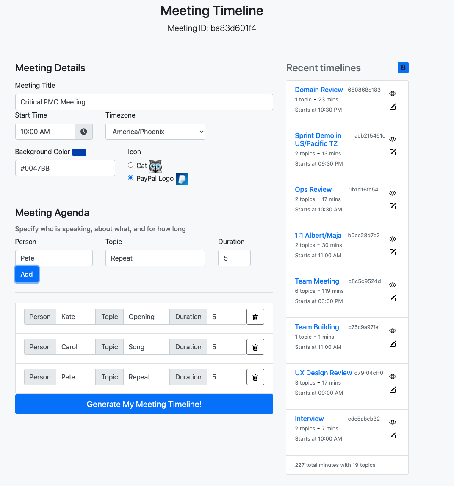
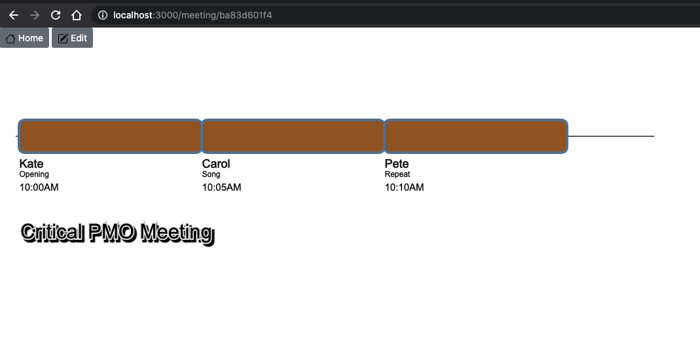
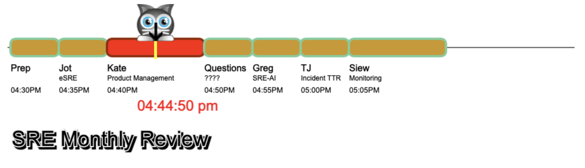

# meeting-timeline
Turn this:


Into this:



or this



and then into this:


I love keeping meetings on schedule.  It's important, now with us working from home, more than ever, that use our time wisely.

Over the last few months, I've been learning Node and came across the [PixiJS HTML5 Game Engine](https://www.pixijs.com/).  With PixiJS, I finally found the technology that I needed to create my _meeting timeline_ concept that merges in the idea of the SpaceX Countdown Timer, with a meeting agenda that I've been wanting to do for _years_.


Something was still missing, I wasn't able to figure out how to splice into my camera feed, until September 4th, then I saw [I prerecorded myself in video meetings for a week (and nobody knew)](https://www.youtube.com/watch?v=b-VCzLiyFxc), specifically at the 1-minute mark where he talks about Virtual Cameras. Ah ha! Now all of the pieces have come together to allow me to do my SpaceX Meeting Timeline!


# Education
I leveraged this [Udemy Course](https://pplearn.udemy.com/course/just-express-with-a-bunch-of-node-and-http-in-detail/learn/lecture/11458246#overview) very heavily to turn my basic app into a proper NodeJS app

# Setup
## Prework
You basically need to follow these instructions from [ohnboiles/obs-mac-virtualcam](https://github.com/johnboiles/obs-mac-virtualcam#installing), I've broken out these steps below:
1. [Download OBS for Mac](https://obsproject.com/download) - use v26.1 to get Virtual Camera built in (no extra extension needed)
2. For MS Teams, [remove the signature](https://obsproject.com/forum/threads/fyi-macos-virtual-cam-on-obs-26-1.135468/) from the application so the Virtual Camera will show up
```
# everything executed with sudo

codesign --remove-signature "/Applications/Skype.app"
codesign --remove-signature "/Applications/Skype.app/Contents/Frameworks/Skype Helper (Renderer).app"
codesign --remove-signature "/Applications/Skype.app/Contents/Frameworks/Skype Helper (GPU).app"
codesign --remove-signature "/Applications/Skype.app/Contents/Frameworks/Skype Helper (Plugin).app"
codesign --remove-signature "/Applications/Skype.app/Contents/Frameworks/Skype Helper.app"

codesign --remove-signature "/Applications/Microsoft Teams.app"
codesign --remove-signature "/Applications/Microsoft Teams.app/Contents/Frameworks/Microsoft Teams Helper.app"
codesign --remove-signature "/Applications/Microsoft Teams.app/Contents/Frameworks/Microsoft Teams Helper (GPU).app"
codesign --remove-signature "/Applications/Microsoft Teams.app/Contents/Frameworks/Microsoft Teams Helper (Plugin).app"
codesign --remove-signature "/Applications/Microsoft Teams.app/Contents/Frameworks/Microsoft Teams Helper (Renderer).app"
```

## Setup OBS
Once you have everything installed, you will need to configure OBS as such:
1. Add a new Scene
2. Add your Webcam
3. Add a Window Capture (make sure this is on top)
4. Right-click on your Window Capture and select "Filters"

5. Under "Effect Filters" select "Chroma Key"
6. Select "Key Color Type" of "Blue" since this code was written for that color
7. Adjust the "Similarity" slider until you see something similar to the gray area shown below

8. Start the Virtual Camera within OBS so other apps can detect it

9. Load up Microsoft Teams and select this new camera option


# To run the timeline code
Note: This requires Redis to be running on your laptop as it's used to store all meeting data
```
git clone <this repo>
cd <this repo's directory you cloned>
npm install
node start.js
```
Aside: I prefer to use `nodemon` so that any edit reloads my Node app.

Then navigate to http://localhost:3000 on your browser.

## To run using Docker
This will start both the NodeJS app and Redis in Docker containers
```
git clone <this repo>
cd <this repo's directory you cloned>
npm install
docker build -t meeting-timeline .
docker-compose up
```
